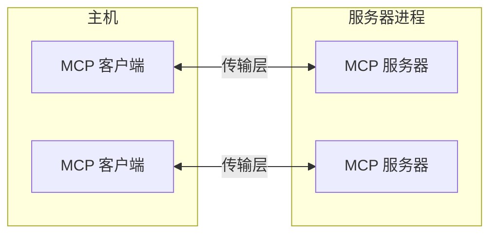
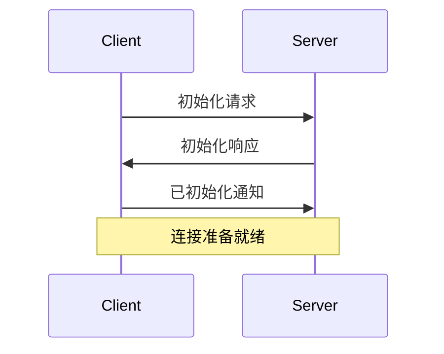

模型上下文协议(MCP)建立在灵活、可扩展的架构之上，使 LLM 应用程序和集成之间能够无缝通信。本文档涵盖了核心架构组件和概念。

## 概述

MCP 遵循客户端-服务器架构，其中：

- **主机**是发起连接的 LLM 应用程序（如 Claude Desktop 或 IDE）
- **客户端**在主机应用程序内与服务器保持 1:1 连接
- **服务器**向客户端提供上下文、工具和提示



## 核心组件

### 协议层

协议层处理消息帧、请求/响应链接和高级通信模式。

<Tabs>
  <Tab title="TypeScript">
    ```typescript
    class Protocol<Request, Notification, Result> {
        // 处理传入请求
        setRequestHandler<T>(schema: T, handler: (request: T, extra: RequestHandlerExtra) => Promise<Result>): void

        // 处理传入通知
        setNotificationHandler<T>(schema: T, handler: (notification: T) => Promise<void>): void

        // 发送请求并等待响应
        request<T>(request: Request, schema: T, options?: RequestOptions): Promise<T>

        // 发送单向通知
        notification(notification: Notification): Promise<void>
    }
    ```
  </Tab>
  <Tab title="Python">
    ```python
    class Session(BaseSession[RequestT, NotificationT, ResultT]):
        async def send_request(
            self,
            request: RequestT,
            result_type: type[Result]
        ) -> Result:
            """
            发送请求并等待响应。如果响应包含错误，则引发 McpError。
            """
            # 请求处理实现

        async def send_notification(
            self,
            notification: NotificationT
        ) -> None:
            """发送不期望响应的单向通知。"""
            # 通知处理实现

        async def _received_request(
            self,
            responder: RequestResponder[ReceiveRequestT, ResultT]
        ) -> None:
            """处理来自另一端的传入请求。"""
            # 请求处理实现

        async def _received_notification(
            self,
            notification: ReceiveNotificationT
        ) -> None:
            """处理来自另一端的传入通知。"""
            # 通知处理实现
    ```
  </Tab>
</Tabs>

关键类包括：

* `Protocol`
* `Client`
* `Server`

### 传输层

传输层处理客户端和服务器之间的实际通信。MCP 支持多种传输机制：

1. **Stdio 传输**
   - 使用标准输入/输出进行通信
   - 适用于本地进程

2. **HTTP with SSE 传输**
   - 使用服务器发送事件进行服务器到客户端的消息传递
   - 使用 HTTP POST 进行客户端到服务器的消息传递

所有传输都使用 [JSON-RPC](https://www.jsonrpc.org/) 2.0 来交换消息。有关模型上下文协议消息格式的详细信息，请参见[规范](https://spec.modelcontextprotocol.io)。

### 消息类型

MCP 有以下主要类型的消息：

1. **请求**期望从另一端获得响应：
    ```typescript
    interface Request {
      method: string;
      params?: { ... };
    }
    ```

2. **结果**是对请求的成功响应：
    ```typescript
    interface Result {
      [key: string]: unknown;
    }
    ```

3. **错误**表示请求失败：
    ```typescript
    interface Error {
      code: number;
      message: string;
      data?: unknown;
    }
    ```

4. **通知**是不期望响应的单向消息：
    ```typescript
    interface Notification {
      method: string;
      params?: { ... };
    }
    ```

## 连接生命周期

### 1. 初始化



1. 客户端发送带有协议版本和功能的 `initialize` 请求
2. 服务器响应其协议版本和功能
3. 客户端发送 `initialized` 通知作为确认
4. 开始正常消息交换

### 2. 消息交换

初始化后，支持以下模式：

- **请求-响应**：客户端或服务器发送请求，另一方响应
- **通知**：任一方发送单向消息

### 3. 终止

任一方都可以终止连接：
- 通过 `close()` 进行清理关闭
- 传输断开连接
- 错误条件

## 错误处理

MCP 定义了这些标准错误代码：

```typescript
enum ErrorCode {
  // 标准 JSON-RPC 错误代码
  ParseError = -32700,
  InvalidRequest = -32600,
  MethodNotFound = -32601,
  InvalidParams = -32602,
  InternalError = -32603
}
```

SDK 和应用程序可以在 -32000 以上定义自己的错误代码。

错误通过以下方式传播：
- 对请求的错误响应
- 传输上的错误事件
- 协议级错误处理程序

## 实现示例

这是一个实现 MCP 服务器的基本示例：

<Tabs>
  <Tab title="TypeScript">
    ```typescript
    import { Server } from "@modelcontextprotocol/sdk/server/index.js";
    import { StdioServerTransport } from "@modelcontextprotocol/sdk/server/stdio.js";

    const server = new Server({
      name: "example-server",
      version: "1.0.0"
    }, {
      capabilities: {
        resources: {}
      }
    });

    // 处理请求
    server.setRequestHandler(ListResourcesRequestSchema, async () => {
      return {
        resources: [
          {
            uri: "example://resource",
            name: "Example Resource"
          }
        ]
      };
    });

    // 连接传输
    const transport = new StdioServerTransport();
    await server.connect(transport);
    ```
  </Tab>
  <Tab title="Python">
    ```python
    import asyncio
    import mcp.types as types
    from mcp.server import Server
    from mcp.server.stdio import stdio_server

    app = Server("example-server")
    ```
  </Tab>
</Tabs> 
